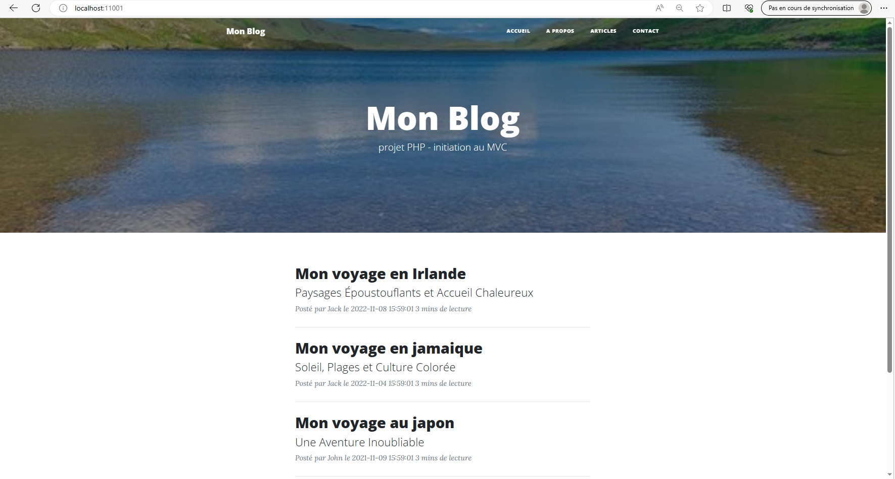
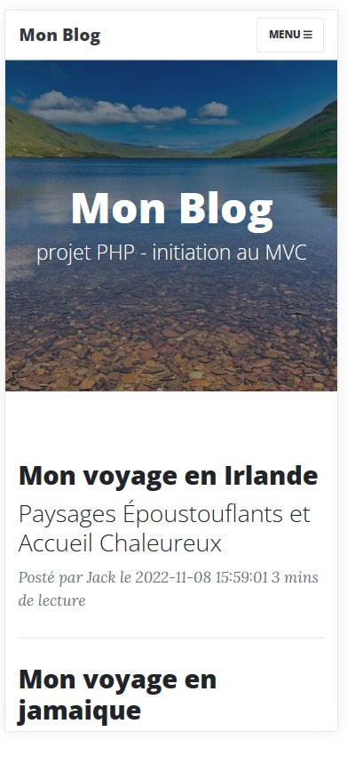
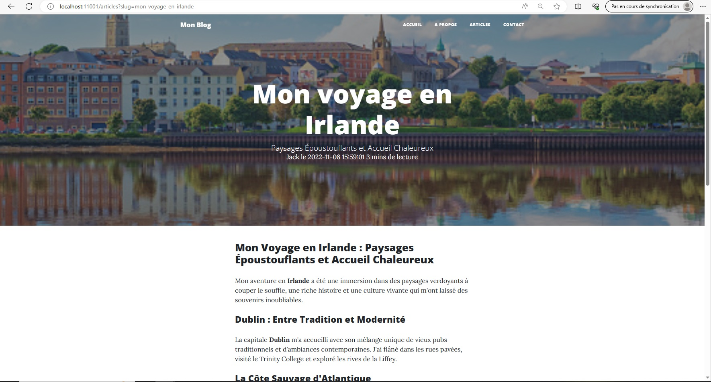

# BLOG - PHP - POO - MVC 
# Projet de mise en pratique de differents apprentissages

## Objectif de ce projet:

- utilisation de PHP
- concept POO
- comprendre et utiliser l'architecture MVC
- structurer le projet
- mise en place de l'autoload composer
- utilisation des variables d'environnement

## Quelques captures d'écran du projet réalisé:
> utilisation de Bootstrap  
> Sass  
> conteneur Docker  
> phpdotenv

#### Accueil :  
  
#### Accueil avec un affichage adapté au smartphone:  
   
#### Un article :  
  